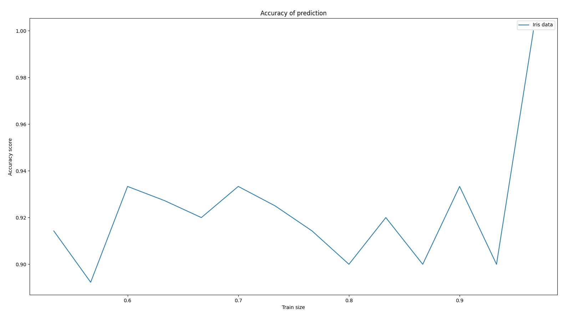

# Naive Bayes Classifier

## Table of contents
* [General info](#general-info)
* [Technologies](#technologies)
* [Results](#results)
* [Setup](#setup)

## General info
This project is an implementation of classifier in Python. 

File `naive_bayes_classifier.py` contains body of basic classes.

File `test_bayes_classifier.py` contains functions which can be used for testing the results.

File `bayes_sprawozdanie.pdf` contains repot of my experiments on this implementation writen in Polish.

### possible_class

It is the class used for every class found in dataset.

### Parameter

It is the class used for every possible attribute.

### Bayes_clasifier

It is main class of classifier which contains every methods used for prediction of result and training the classifier.
	
## Technologies
Project is created with libreries:
* numpy
* math
* statistics

For the testing I use:
* matplotlib
* sklearn
## Results
Test is mede on the `iris.data` dataset from [dataset page](https://archive.ics.uci.edu/ml/datasets/iris).

### Accuracy score based on training sample size

	
## Setup
To test this project, install required libreries and run `test_bayes_classifier.py` file.
